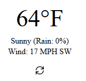

# Weather

Weather is a react app utilizing open-meteo wriiten in typescript built down to es5.

## Installation

```bash
npm install @egeonu/weather
```

## Usage

### getWeatherOpenMeteo
```javascript
import React from 'react'
import ReactDOM from 'react-dom/client';
import { getWeatherOpenMeteo } from '@egeonu/weather';

  const weather = await getWeatherOpenMeteo(32.679420,-97.028336,'f');
  console.log(weather);
```
[Example Output](weather-array.json)

### Weather
```javascript
import React from 'react'
import ReactDOM from 'react-dom/client';
import WeatherUI from '@egeonu/weather';

const root = ReactDOM.createRoot(
  document.getElementById('root') as HTMLElement
);

root.Weather(
    <WeatherUI longitude={-97.028336} latitude={32.679420} temperature_unit='f' wind_speed_unit='mph'/>
);
```
#### Example Output


## Contributing
Pull requests are welcome. For major changes, please open an issue first
to discuss what you would like to change.

Please make sure to update tests as appropriate.

